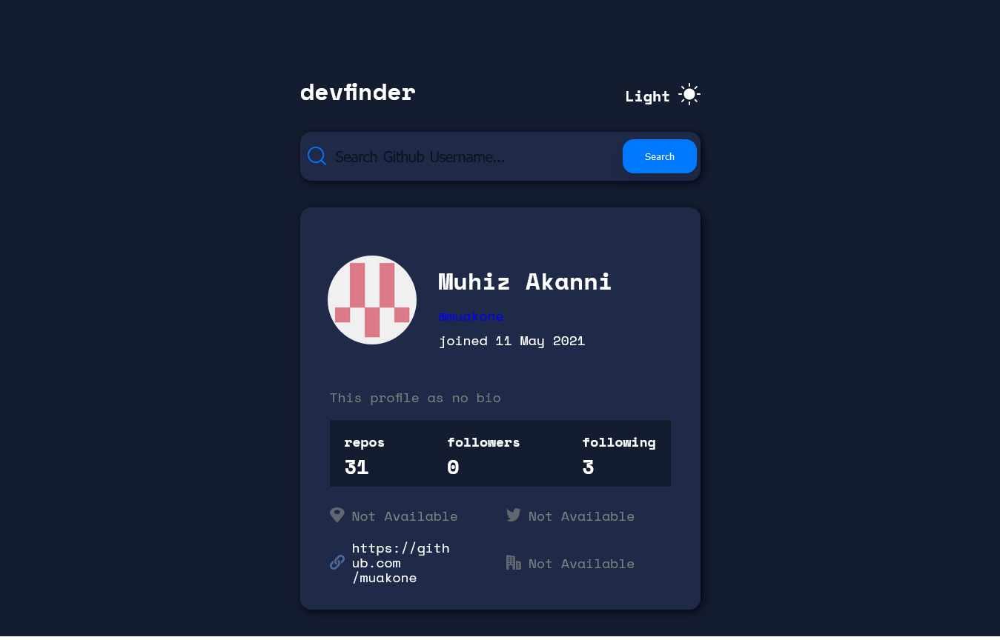
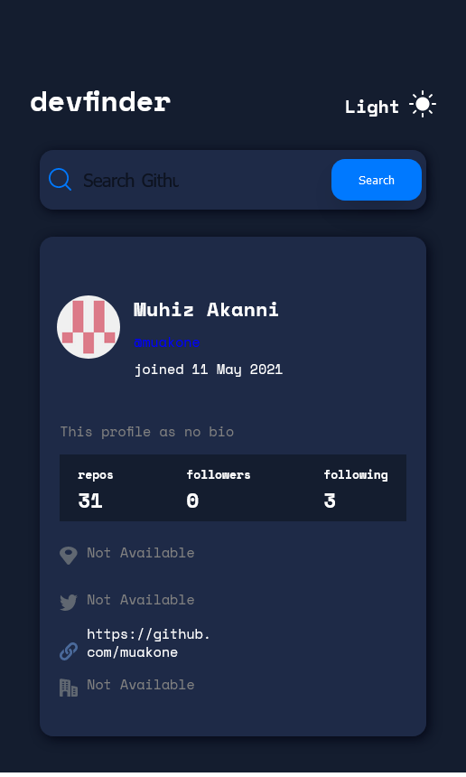

# Github User Search App

## Overview

This is a solution to the GitHub user search app challenge on Frontend Mentor. Frontend Mentor challenges help you improve your coding skills by building realistic projects.

### Live Link : (http://muakone.github.io/dev-finder/).

## Features 

### Users should be able to:

* View the optimal layout for the app depending on their device's screen size.

* See hover states for all interactive elements on the page.

* Search for GitHub users by their username.

* See relevant user information based on their search.

* Switch between light and dark themes.

* Click on website link and twitter username takes you to their respective sites

### Screenshot

## Tech Used / Dependencies

* This is a React App with CRA
* Api from [Github api](https://api.github.com/)
* Add-on packages include:

  - React-Icon
* Fonts from [Google Fonts](https://fonts.google.com/)

